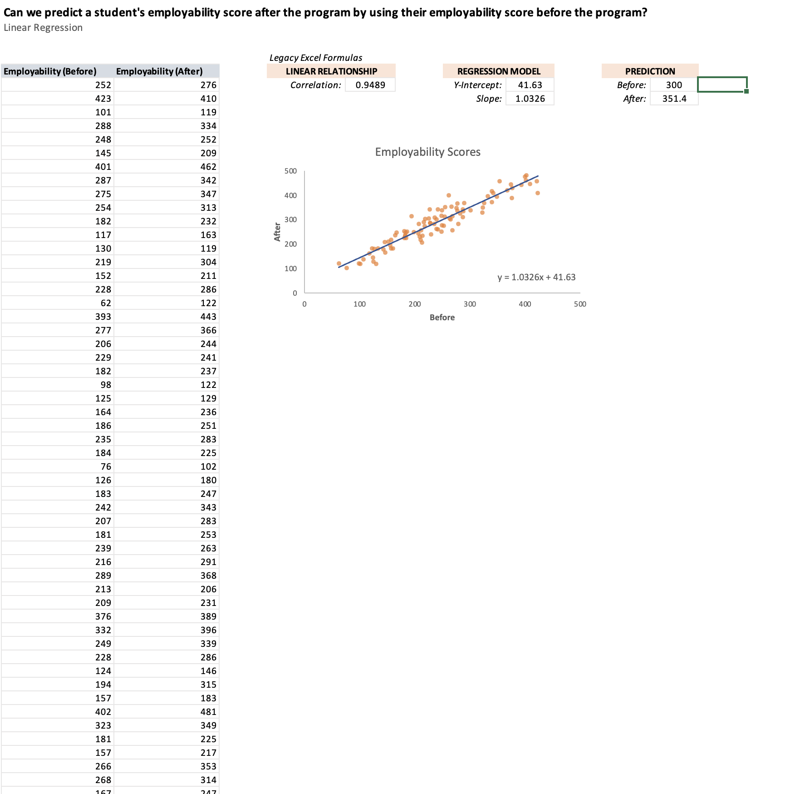
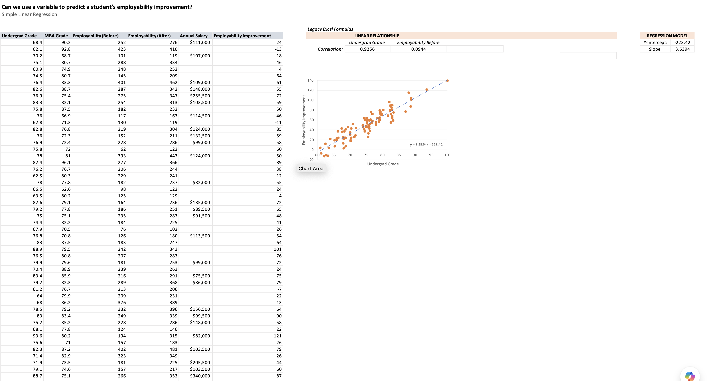
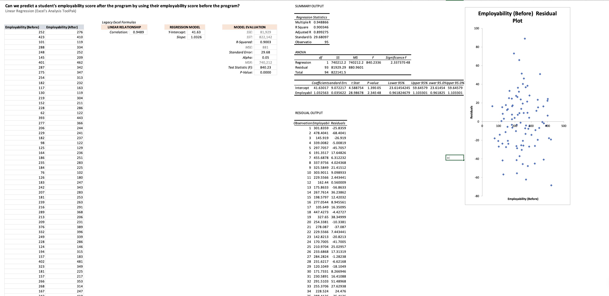

# Statistical Analysis in Excel

An end-to-end statistics workbook that analyzes an (anonymized) **MBA graduate
outcomes** dataset — undergraduate background, grades, work experience,
employability scores, placement status, and salary — to answer real business
questions at each step. It runs from descriptive statistics all the way through
inferential statistics and regression modeling.

**File:** [`excel-statistics.xlsx`](excel-statistics.xlsx) · ~60 worksheets, organized by topic with a built-in Table of Contents.

> **Data note:** the dataset uses anonymized Student IDs (no names or personal
> identifiers). It's a sample/teaching dataset used to demonstrate technique.

## Sample output

**Simple linear regression** — predicting a student's post-program employability
score from their pre-program score (correlation ≈ 0.95), with fitted trendline and
a prediction:

**Multiple linear regression** — modeling employability improvement from several
predictors (grades, prior scores, salary):

**Regression via the Excel Analysis ToolPak** — full summary output, ANOVA table,
significance tests, and a residual plot for model diagnostics:

## What it covers

### 1. Descriptive statistics
Frequency & categorical distributions, histograms, measures of **central tendency**
(mean/median/mode), **variability** (range, IQR, variance, standard deviation,
coefficient of variation), **skew**, quartiles, and box-and-whisker plots.

### 2. Probability & the normal distribution
Z-scores, the empirical rule, and the full family of normal-distribution functions
(`NORM.DIST`, `NORM.S.DIST`, `NORM.INV`, `NORM.S.INV`) for calculating
probabilities and estimating values under the curve.

### 3. Confidence intervals
Interval estimation and margin of error for means (z and t), proportions, and the
differences between dependent samples, independent samples, two means, and two
proportions.

### 4. Hypothesis testing
The complete workflow — null & alternative hypotheses, significance level, test
statistic, p-value, and conclusion — applied to one- and two-tailed tests for
means, proportions, paired differences, and two-sample comparisons.

### 5. Correlation & regression
Scatterplots, correlation, **simple and multiple linear regression**, predictions,
R-squared, standard error, homoskedasticity checks, model evaluation, and
regression via the Excel **Analysis ToolPak**.

## Skills demonstrated

- Descriptive **and** inferential statistics, applied to business questions
- Excel statistical functions, **PivotTables**, dynamic-array formulas, and the **Analysis ToolPak**
- Translating raw data into evidence-based conclusions (CI and hypothesis-test reasoning)
- Regression modeling and interpretation (fit, significance, prediction)

## How to view

GitHub can't preview Excel files. **Download** the workbook and open in Excel
(enable the Analysis ToolPak via *File → Options → Add-ins* for the regression
sheets), or import into Google Sheets.
